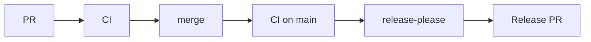

### Workflow Structure

```
.github/
└── workflows/
    ├── ci.yml
    ├── release-please.yml
    └── publish.yml
```

`ci.yml`

Responsible for:

- dependency installation
- linting
- formatting checks
- unit tests
- integration tests
- package build
- possibly Python-version matrix

`release-please.yml`

Responsible for:

- analyzing conventional commits
- calculating the next version
- updating changelog
- updating package version
- creating/updating the Release PR
- creating the GitHub release/tag after the Release PR is merged

`publish.yml`

Responsible for:

- building the package
- publishing to PyPI
- potentially publishing Docker images
- other release artifacts

---

### Flow

1st flow to follow:



Then:

